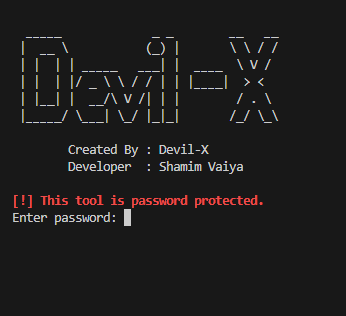
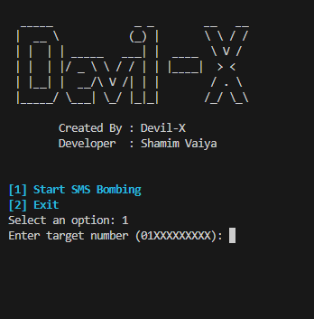
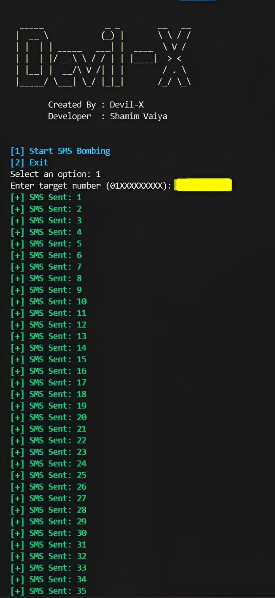

# 🔥 Devil-X BD SMS Tool


**Devil-X BD SMS Tool** হলো একটি শক্তিশালী এবং ফাস্ট SMS বোম্বিং টুল ।  এটি শিক্ষার উদ্দেশ্যে এবং টেস্টিংয়ের জন্য তৈরি করা হয়েছে।

> ⚠️ **সতর্কবার্তা:** এই টুলটি শুধুমাত্র **শিক্ষামূলক উদ্দেশ্যে (Educational Purpose Only)** তৈরি করা হয়েছে। এর অপব্যবহার সম্পূর্ণভাবে ব্যবহারকারীর দায়িত্ব।

---

## 🛠️ ফিচারস (Features)
- ✅ **Secure & Encrypted**
- ✅ **Fast API Integration**
- ✅ **User-Friendly Interface**
- ✅ **Password Protected**

---

## 📥 Installation

```bash
git clone https://github.com/Anonymous-Cyber-Team/Devil-SMS-Tool.git
cd Devil-SMS-Tool
python Run.py
```

---

## 🔐 Login Information (Credentials)

| Type | Access Key |
|------|------------|
| Password | Devil-X |

---

## 📸 Screenshots

> নিচের তিনটি ছবির জায়গায় আপনি আপনার নিজের স্ক্রিনশট বা ছবি লিঙ্ক বসিয়ে দিবেন।

```



```

---

## 👨‍💻 Developer Info

Created By: **Devil-X**
Developer: **Shamim Vaiya**
Team: **Anonymous Cyber Team**

---

## 📞 Contact Admin

<div style="display: flex; align-items: center; gap: 25px; margin-top: 10px;">

  <a href="https://facebook.com/AnonymousCyberTeamOfficial" target="_blank">
    
  </a>

  <a href="https://wa.me/8801540580575" target="_blank">
    
  </a>

  <a href="https://t.me/shamim_vaiya" target="_blank">
    
  </a>

</div>


---

## 📜 License

এই টুলটির সম্পূর্ণ কোড কপিরাইট এর আওতাভুক্ত। অনুমতি ছাড়া কপি বা মডিফাই করা যাবে না।
